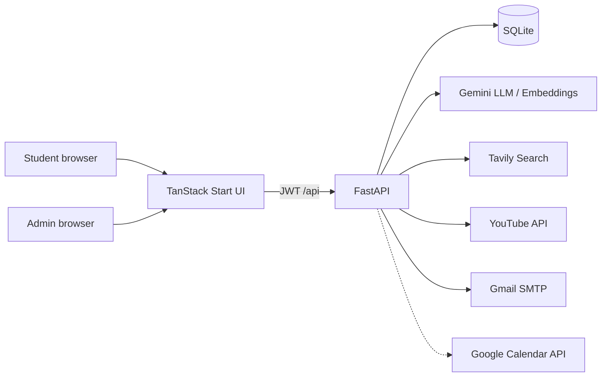
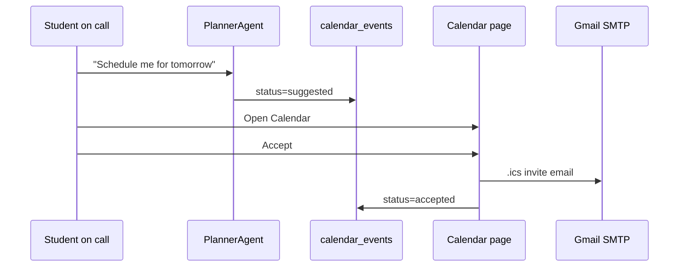

# Architecture

Tele-Exit is a full-stack AI automation system that replaces (and extends) the repetitive work of an **exit-exam study coach**: tutoring from a real question bank, researching clarifications, recommending videos, tracking weak topics, and proposing study sessions.

## Design principles

1. **Hexagonal architecture** — domain logic does not import FastAPI or Gemini SDKs; ports define capabilities; adapters implement them.
2. **Identity from JWT** — student/admin IDs come from the token, never from client-supplied path/body IDs for authorization.
3. **Real exam data only** — Curriculum answers are grounded in admin-uploaded questions for the student’s field of study.
4. **Honest delivery** — calendar Accept requires real invite delivery (SMTP `.ics`); no silent fake Google event IDs.
5. **Demo reliability** — study call uses browser speech + HTTP voice turns so demos work without a full LiveKit mesh.

## System context



## Backend layers

```
app/
├── domain/          # models, agents, practice coach, wrap-up, ICS
├── ports/           # ABCs: LLM, search, video, email, calendar, repo, …
├── adapters/
│   ├── fakes/       # local tests / USE_FAKES=true
│   └── real/        # Gemini, Tavily, YouTube, SMTP, SQLite, LiveKit, …
├── routes/          # HTTP + WebSocket
├── auth/            # JWT, password hashing, role guards
├── ingestion/       # parse upload → embed → store
├── core/            # DI, orchestrator, outbox, report saga
└── main.py
```

### Composition root (`app/core/di.py`)

| `USE_FAKES` | Behavior |
|-------------|----------|
| `false` (demo) | Gemini, Tavily, YouTube, SMTP, Google Calendar adapter, LiveKit |
| `true` (tests) | Fake LLM/search/video; optional real SMTP if configured |

## Agents

| Agent | Responsibility | Trigger (study call) |
|-------|----------------|----------------------|
| **Supervisor** | Intent classification | WS orchestrator path |
| **Curriculum** | RAG over uploaded questions + coaching | Default / hints |
| **Memory** | Profile, weak topics, readiness | “How am I doing?” |
| **Search** | Web research via Tavily | “Search the web…” |
| **YouTube** | Find study clips | “Show me a video…” |
| **Planner** | Create **suggested** calendar rows | “Schedule me for tomorrow” |
| **Synthesizer** | Sentence split for TTS chunks | Implemented; optional wiring |

### Two call paths

| Path | Used by | Routing |
|------|---------|---------|
| `POST /exams/attempts/{id}/chat` `mode=voice` | **Primary UI** (`/call`) | Keyword + memory/planner/search/youtube + practice coach |
| `WS /ws/call?token=` | Spec / advanced | Full `Orchestrator` + Supervisor |

Both hydrate **Memory** and can invoke **Planner** (suggestions only until Accept).

## Field-of-study isolation

1. Student registers with `field_of_study`.
2. Admin uploads exams tagged with the same field.
3. `GET /exams` and attempt start **filter** by normalized field match.
4. CS students never see Software Engineering packs (and vice versa).

## Calendar automation



Google Calendar API is attempted when credentials work; **SMTP `.ics` is the reliable demo path**.

## Frontend structure

| Route | Purpose |
|-------|---------|
| `/` | Landing + support chatbot |
| `/login`, `/register` | Auth + onboarding (field, exam date) |
| `/dashboard` | Readiness, shortcuts |
| `/exams`, `/exams/$examId` | Field-filtered exams, practice/exam |
| `/call` | Live study call UI |
| `/calendar` | Suggestions + Accept |
| `/progress`, `/session-recap` | Scores & wrap-up |
| `/settings` | Coach prefs, report cadence |
| `/admin/*` | Users & question upload |

Speech: Web Speech API (recognition + synthesis) with coach prefs from Settings.

## Data stores (SQLite)

- `users` — students & admins (`role`)
- `exams` / `exam_questions` / `exam_attempts`
- `learner_profiles` / `topic_scores` / `session_events`
- `calendar_events` — `suggested` \| `accepted`
- `outbox` — durable side effects (reports, etc.)
- Embeddings — local vector table (JSON floats + cosine similarity)

## Security

- Passwords hashed (bcrypt)
- JWT bearer tokens (7-day default)
- `get_current_student_id` / `get_current_admin`
- Admin-only upload endpoints (`403` for students)
- CORS allowlist via `CORS_ORIGINS`

## Related docs

- [DEMO_GUIDE.md](DEMO_GUIDE.md) — rehearsal script  
- [API.md](API.md) — endpoints  
- [ASSIGNMENT.md](ASSIGNMENT.md) — assignment mapping  
- Backend Spec v3 — `docs/.specs/`
